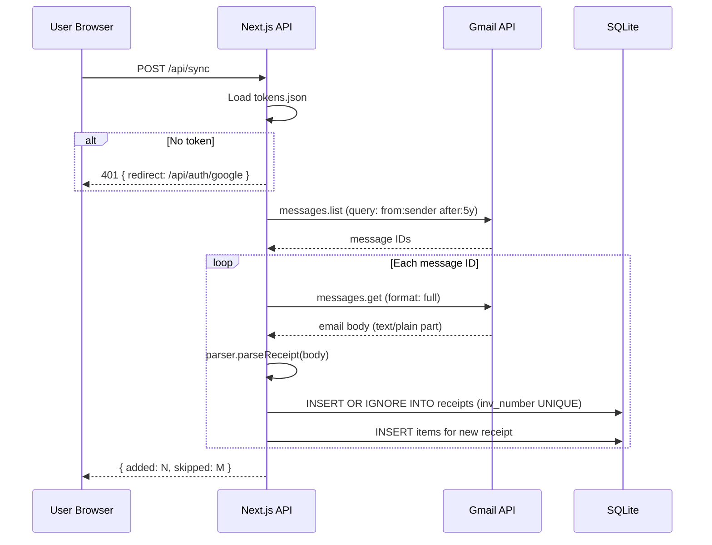

# Longo's Receipt Analyzer — Architecture Plan

## Overview

A locally-run Next.js application that:

1. Authenticates with Gmail via Google OAuth2
2. Downloads Longo's receipt emails and parses them
3. Stores structured data in a local SQLite database
4. Visualizes spending trends via a multi-page UI

---

## Tech Stack

| Layer     | Technology                                   |
|-----------|----------------------------------------------|
| Framework | Next.js 16 (App Router)                      |
| Language  | TypeScript                                   |
| Styling   | Tailwind CSS 4                               |
| Database  | SQLite via `better-sqlite3`                  |
| Gmail API | `googleapis`                                 |
| Charts    | `recharts`                                   |
| Auth      | Google OAuth2 (Web flow, localhost redirect) |

---

## Project File Structure

```
longos-analyzer/
├── app/
│   ├── layout.tsx                   # Root layout with nav
│   ├── page.tsx                     # Dashboard page
│   ├── items/
│   │   └── page.tsx                 # Items table page
│   └── items/[slug]/
│       └── page.tsx                 # Item detail page
├── app/api/
│   ├── auth/
│   │   ├── google/route.ts          # GET: redirect to Google OAuth
│   │   └── callback/route.ts        # GET: handle OAuth callback, save token
│   ├── sync/
│   │   └── route.ts                 # POST: trigger Gmail sync
│   ├── stats/
│   │   ├── monthly/route.ts         # GET: spend per month
│   │   ├── categories/route.ts      # GET: spend per category
│   │   └── summary/route.ts         # GET: top-level KPIs
│   ├── items/
│   │   └── route.ts                 # GET: items list with sort/filter
│   └── items/[slug]/
│       └── route.ts                 # GET: item detail + price history
├── lib/
│   ├── db.ts                        # SQLite singleton + schema init
│   ├── gmail.ts                     # Gmail API client + email fetcher
│   ├── parser.ts                    # Receipt plain-text parser
│   └── auth.ts                      # OAuth token read/write (tokens.json)
├── components/
│   ├── NavBar.tsx                   # Top navigation bar
│   ├── SyncButton.tsx               # Sync trigger + status indicator
│   ├── SpendingLineChart.tsx        # Monthly/yearly spend line chart
│   ├── CategoryPieChart.tsx         # Category breakdown donut chart
│   ├── TopItemsTable.tsx            # Most-spent items summary
│   ├── ItemsTable.tsx               # Full sortable/filterable items table
│   └── PriceHistoryChart.tsx        # Bar chart of price over time (item detail)
├── data/
│   └── receipts.db                  # SQLite file (gitignored)
├── tokens.json                      # OAuth tokens (gitignored)
├── .env.local                       # GOOGLE_CLIENT_ID, GOOGLE_CLIENT_SECRET
└── plans/
    └── architecture.md              # This file
```

---

## Database Schema

```sql
CREATE TABLE receipts
(
    id               INTEGER PRIMARY KEY AUTOINCREMENT,
    inv_number       TEXT UNIQUE NOT NULL, -- "00002673"
    email_message_id TEXT UNIQUE,          -- Gmail message ID
    timestamp        DATETIME    NOT NULL, -- "2025-11-18 18:43:46"
    total_amount     REAL        NOT NULL, -- 165.29
    raw_text         TEXT,                 -- original email body
    synced_at        DATETIME DEFAULT CURRENT_TIMESTAMP
);

CREATE TABLE items
(
    id             INTEGER PRIMARY KEY AUTOINCREMENT,
    receipt_id     INTEGER NOT NULL REFERENCES receipts (id),
    name           TEXT    NOT NULL,  -- "EMPIRE APPLES"
    category       TEXT    NOT NULL,  -- "PRODUCE"
    amount         REAL    NOT NULL,  -- 12.43
    date           DATE    NOT NULL,  -- "2025-11-18"
    on_sale        INTEGER DEFAULT 0, -- 1 if SALE marker present
    hst_applicable INTEGER DEFAULT 0  -- 1 if H marker present
);

CREATE INDEX idx_items_name ON items (name);
CREATE INDEX idx_items_category ON items (category);
CREATE INDEX idx_items_date ON items (date);
```

---

## Receipt Parser Logic

The parser (`lib/parser.ts`) processes the plain-text email body:

```
State machine approach:
  1. Scan for "Inv#:XXXXXXXX" → extract invoice number
  2. Scan for "#035-004 MM/DD/YYYY HH:MM:SS" → extract timestamp
  3. Scan for "Amount       : $X.XX" (credit card block) → extract total
     Fallback: scan for "Total      $X.XX" line
  4. Scan lines top-to-bottom:
     - A line of ALL CAPS with leading space = category header (e.g., " PRODUCE")
     - An item line matches: NAME   $AMOUNT [SALE] [H]
       Example regex: /^(.+?)\s{2,}\$(\d+\.\d{2})\s*(SALE)?\s*(H)?$/
  5. Each item inherits the most recent category header
```

**Edge cases to handle:**

- Weight-priced items: `2.265 kg @ $5.49/kg` line appears *between* an item's name and price — the item name is the line
  *before* this, and the price is the line *after*. Actually re-reading: the item line itself shows the total price. The
  `2.265 kg @ $5.49/kg` line is the weight detail, inserted before the next item.
- Items with `SALE` and/or `H` suffix flags
- Multiple items of the same name in one receipt

---

## Gmail Sync Flow



**Gmail search query:**

```
from:(longos OR longo's) subject:receipt
```

This can be stored in `.env.local` as `GMAIL_SEARCH_QUERY` so it's adjustable without code changes.

---

## OAuth2 Setup (Google Cloud)

Since the user needs to set up Google Cloud credentials, the README will include:

1. Go to [console.cloud.google.com](https://console.cloud.google.com)
2. Create a new project
3. Enable **Gmail API** under APIs & Services → Library
4. Go to APIs & Services → Credentials → Create Credentials → **OAuth 2.0 Client ID**
5. Application type: **Web application**
6. Authorized redirect URI: `http://localhost:3000/api/auth/callback`
7. Download the credentials and add to `.env.local`:
   ```
   GOOGLE_CLIENT_ID=xxx
   GOOGLE_CLIENT_SECRET=xxx
   NEXT_PUBLIC_BASE_URL=http://localhost:3000
   GMAIL_SEARCH_QUERY=from:(donotreply@longos.com) subject:receipt
   ```

The first time the user clicks **Sync**, they will be redirected to Google's OAuth consent screen. After approval, the
token is saved to `tokens.json` and all future syncs are automatic.

---

## UI Pages

### Dashboard (`/`)

- **Sync button** (top right): triggers `POST /api/sync`, shows progress/results
- **KPI cards**: Total spent (all time), Number of receipts, Avg spend per trip, Most purchased category
- **Monthly Spend Line Chart**: Toggle between last 12 months / all years (yearly view)
- **Category Donut Chart**: Proportion of spend by category
- **Top 10 Most Spent Items**: Mini table with name, category, total spend

### Items Table (`/items`)

- **Category filter** (dropdown): filter by PRODUCE, GROCERY, DAIRY, etc.
- **Search box**: filter by item name (debounced)
- **Sortable columns**: Item Name | Category | Total Spent | Times Purchased | Avg Price
- Click any row → navigate to `/items/[slug]`

### Item Detail (`/items/[slug]`)

- **Search field at top**: type to search any item name → navigate to that item's detail page
- **Stats card**: Total spent, Times purchased, Avg price, First seen, Last seen
- **Price History Bar Chart**: price on Y-axis, date of each purchase on X-axis (shows price fluctuations and SALE
  prices highlighted differently)
- **Recent Purchases table**: date | price | on sale?

---

## Additional Useful Visualizations

1. **Spend by Day of Week** — bar chart: which days you shop most
2. **Average Basket Size Over Time** — are trips getting more expensive?
3. **Savings Summary** — total saved via SALE prices (requires tracking SALE flag + estimated regular price, or just
   count of SALE items)
4. **HST Paid Per Month** — track taxable items over time
5. **Category Trends Over Time** — stacked area chart showing how spend per category shifts month to month

---

## Key Dependencies to Install

```bash
npm install googleapis better-sqlite3 recharts
npm install --save-dev @types/better-sqlite3
```

---

## Environment Variables (`.env.local`)

```env
GOOGLE_CLIENT_ID=your_client_id
GOOGLE_CLIENT_SECRET=your_client_secret
NEXT_PUBLIC_BASE_URL=http://localhost:3000
GMAIL_SEARCH_QUERY=from:donotreply@longos.com
```

---

## Gitignore Additions

```
data/
tokens.json
.env.local
```
